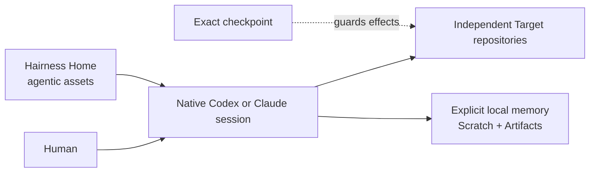

# Hairness

**A lightweight, provider-agnostic harness for agentic assets.**

Hairness gives Codex and Claude the same small set of powerful ways to discuss,
map, remember, and safely ship work—without replacing their UI, runtime, tools,
threads, or native skills.

> [!WARNING]
> Hairness is an experimental alpha. v0.3 is a breaking reset with no in-place
> upgrade from v0.2. Pin exact versions and review effect checkpoints.

Node.js **22+** · Providers **Codex and Claude** · License **MIT**

## From install to a useful agent session

Create a Home. The CLI asks five questions: response language, Standard or
Minimal setup, providers, a detected first Target, and whether the Overlay
should have its own local Git history.

```bash
npx --yes @hairness/cli@next create ~/Hairness
```

Standard is recommended. The CLI previews every local effect, installs and pins
`@hairness/cli`, builds provider assets, runs doctor, initializes the Home Git
repository, optionally initializes a nested Overlay Git repository, and only
then atomically moves the complete Home into place. It creates no remote and
never pushes.

The final output gives the exact launch command:

```bash
codex -C "$HOME/Hairness" --add-dir "/path/to/your-project"
```

```bash
cd "$HOME/Hairness" && claude --add-dir "/path/to/your-project"
```

Then invoke `$hairness-onboarding` in Codex or `/hairness-onboarding` in Claude.
The agent speaks your selected language from its first reply, explains concepts
only when they become useful, and resumes after every answer.

That is the complete setup flow.

## What the Home changes



A **Home** is the agent's stable operating place. A **Target** is an independent
repository it can inspect or change. A **Scratch** is optional, flexible memory
for a real subject. An **Artifact** is an accepted outcome with a typed envelope
and one canonical Markdown or JSON payload.

Sessions start ephemeral. Without an active Scratch, Hairness writes nothing.
With one attached, the agent records only semantic boundaries such as accepted
decisions, changed constraints, handoffs, and next-step changes—never a
transcript or hidden reasoning.

## Ten human commands

Standard guarantees exactly these commands:

```text
hairness
hairness-onboarding
hairness-scratch
hairness-discuss
hairness-map
hairness-ideate
hairness-propose
hairness-recap
hairness-plan
hairness-ship
```

Codex projects them as `$hairness-…`; Claude projects `/hairness-…`.

- Discuss, ideate, propose, recap, map, and plan render directly in chat.
- A recap, map, or plan creates no file until you say “save this.”
- `hairness-ship` creates no durable delivery state until you accept its
  DeliveryBrief.
- Worktrees are an internal adaptive detail: a clean compatible checkout is
  reused; dirty, occupied, incompatible, or parallel work is isolated.
- PR publication, merge, and release remain separate checkpoints.

## Agentic assets are software

Provider prompts are not the durable unit. An extension describes capability
IDs, recipes, deterministic adapters, schemas, gates, onboarding questions, and
tests. These assets are explicit, reviewable, versioned, and portable. Hairness
supplies the common harness and native provider projections; the extension keeps
the domain opinion.

A chat extension can be only two files:

```text
acme/review/
├── extension.json
└── review.md
```

```json
{
  "apiVersion": "hairness.dev/extension/v1alpha1",
  "kind": "Extension",
  "metadata": {
    "id": "acme/review",
    "version": "1.0.0",
    "summary": "Review one change in chat."
  },
  "spec": {
    "provides": ["acme.review"],
    "requires": ["hairness.cockpit"],
    "recipes": [{
      "id": "hairness-review",
      "path": "review.md",
      "summary": "Review one change.",
      "capability": "acme.review"
    }],
    "adapters": [],
    "schemas": [],
    "gates": [],
    "onboarding": [],
    "tests": []
  }
}
```

```markdown
Review the requested change. Cite live source paths, rank actionable findings,
and render the result in chat. Persist nothing unless the user asks to save it.
```

Install it from a local path or a pinned Git source:

```bash
hairness extension add ./acme/review
hairness extension add https://github.com/acme/review.git \
  --ref v1.2.0 \
  --path extensions/acme/review
```

Hairness inspects the manifest without importing code, resolves Git refs to
immutable commits, stages and validates the source, then shows the exact
composition change. The extension activates only after its checkpoint. An
intact install updates mechanically; local divergence stops for a human merge.

## Source ownership without provider coupling

The generated Home tracks only agentic source:

```text
Hairness/
├── package.json
├── package-lock.json
├── hairness.json
├── hairness.lock.json
├── extensions/
├── AGENTS.md
├── CLAUDE.md
├── .agents/skills/.gitkeep
├── .claude/skills/.gitkeep
└── .overlay/
```

Generated provider skills are reproducible local build output. Hairness records
their exact paths in `~/.hairness/runtime/<home-id>/build.json` and adds only
those paths to the Home repository's `.git/info/exclude`. It neither ignores nor
clears whole provider directories, so user-authored native skills remain normal
Git-visible files.

Local Target paths, provider bindings, checkout locks, build state, caches, and
checkpoints stay under `~/.hairness/`. They never leak into tracked Home files.

## Minimal, Standard, and custom distributions

- **Minimal:** `hairness/cockpit` + `hairness/work`.
- **Standard:** adds sources, codebase maps, and safe delivery; this is the
  default.
- **Custom:** starts from an explicit Distribution path, then installs only its
  selected extensions.

A Distribution is only a bootstrap bundle of defaults, policies, onboarding,
and extensions. It contains no copied kernel, runtime, Overlay, Target, or
generic workflow engine.

## Deterministic boundary

The provider uses the CLI only when deterministic state or effects matter:

```text
hairness build|doctor|opening
hairness onboarding status|answer|plan|apply
hairness extension list|init|adopt|add|update|remove|doctor
hairness target list|add|remove|doctor
hairness scratch list|show|create|use|note|park|close|import|snapshot
hairness artifact list|show|save|validate
hairness overlay status|snapshot|archive
hairness operation run|prepare|apply
```

Observe and derive adapters may run directly. Every effect uses `prepare`, which
binds exact inputs, Target state, proof, and policy. `apply` revalidates all of
them and refuses stale state. Successful or unknown effects produce immutable
Receipts.

## Upgrading from v0.2

Create a new Home; do not migrate in place. A complete legacy Overlay may be
archived opaquely under `~/.hairness/archives/`, and selected human notes can be
imported into a new Scratch. v0.3 has no old command aliases, schema readers,
runtime bridge, or automatic Overlay conversion.

## Documentation and development

- [Specification](SPEC.md)
- [Architecture](docs/architecture.md)
- [Persistence](docs/persistence.md)
- [Extension contract](docs/extensions/README.md)
- [Security model](docs/security-model.md)
- [Current status](STATUS.md)

```bash
npm install
npm test
npm run check
npm run conformance
npm run check:providers
npm run check:pack
npm run check:lab
```

See [CONTRIBUTING.md](CONTRIBUTING.md) and [SECURITY.md](SECURITY.md). Hairness is
licensed under the [MIT License](LICENSE).
