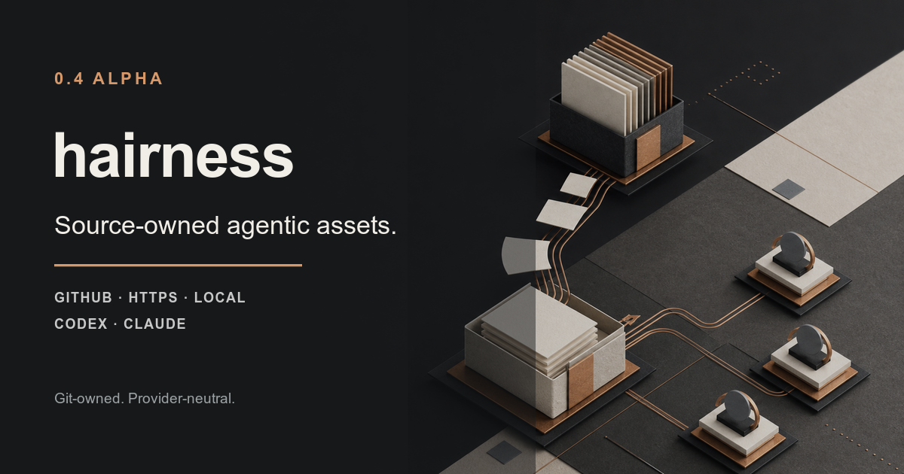
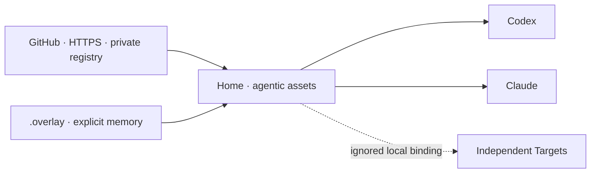

# Hairness

**Own the agentic assets your agents work with.**



Hairness copies Skills, instructions, knowledge and approved Adapters into a
Git-owned Home, then projects them to Codex, Claude and future agent runtimes.
The source stays yours: read it, edit it, review it and commit it.

```text
Registry manifest → hairness add → source-owned files → Git
                                          ↓
                                    hairness build
                                          ↓
                                  Codex · Claude · …
```

Hairness is a small, provider-neutral arranger for an organization’s **agentic
assets**: the useful material that helps agents understand people, work and
domain context. Providers keep control of runtimes and sessions. Git keeps
control of source history.

> `0.4.0-alpha.0` is a prerelease. Pin the exact runtime and review every
> Adapter before allowing it to build.

Node.js 22 or 24 · MIT

## Start with a Home

```bash
npx --yes @hairness/cli@0.4.0-alpha.0 create "$HOME/my-home"
cd "$HOME/my-home"
npx --yes @hairness/cli@0.4.0-alpha.0 doctor
```

That creates a Git repository with no npm project, local dependency tree or
Hairness lockfile:

```text
my-home/
├── hairness.json                     # runtime, providers, registries, Targets
├── extensions/
│   └── hairness/core/                # readable, editable source
│       ├── hairness.item.json        # provenance receipt
│       ├── instructions/
│       └── skills/
├── .overlay/                         # explicit human memory and preferences
├── targets/                          # ignored bindings to independent repos
├── AGENTS.md                         # managed Codex contract
└── CLAUDE.md                         # managed Claude contract
```

`hairness.json#runtime` fixes the exact CLI used by commands and provider hooks.
`.hairness/build.json` is ignored, reproducible build state. Git is the history,
rollback and collaboration layer.

## Add an Extension as source

A registry is a JSON manifest in any Git repository or HTTPS endpoint:

```json
{
  "$schema": "https://hairness.dev/schema/registry.json",
  "name": "acme-agentic-assets",
  "items": [
    {
      "name": "tech",
      "version": "1.2.0",
      "type": "hairness:extension",
      "title": "Acme Tech",
      "description": "Shared engineering context and practices.",
      "registryDependencies": ["@company/security"],
      "files": [
        {
          "path": "tech/skills/review/SKILL.md",
          "type": "hairness:skill",
          "id": "review",
          "description": "Review a change in Acme context."
        },
        {
          "path": "tech/knowledge/architecture.md",
          "type": "hairness:file"
        }
      ]
    }
  ]
}
```

Install from a namespace, GitHub, HTTPS or a local manifest:

```bash
hairness add @company/tech -y
hairness add acme/agentic-assets/tech#v1.2.0 -y
hairness add https://assets.acme.test/tech.json -y
hairness add ./registry.json -y
```

Git tags and commits make a bootstrap reproducible. Unpinned Git, URL and local
sources are allowed for exploration and shown as mobile by `hairness status`.
Private registry headers may interpolate environment variables; resolved secrets
are never written to receipts or output.

## Customize and synchronize

Installed files are deliberately editable. Hairness records the digest it
originally copied for each declared file:

```bash
hairness status tech
hairness diff tech
hairness sync tech --check
hairness sync tech
```

- An intact Extension updates atomically.
- A changed or missing declared file stops sync and shows the divergence.
- `--overwrite` explicitly lets upstream replace local customizations.
- Undeclared local files are always preserved.
- No automatic update, merge daemon or global dependency solver exists.

This follows the source-owned model used by shadcn. Distribution supplies a
starting point. Hairness adds provenance and cautious synchronization, while Git
handles history.

## Build for any provider

```bash
hairness build
hairness build --check
hairness doctor --json
hairness prologue
```

The Kernel discovers installed receipts, composes instructions and Skills, and
generates native provider files. The same Home remains stable when the active
agent runtime changes.

Adapters are source files too, but `add` and `sync` never execute them:

```bash
hairness build --allow-adapter hairness-gsd
```

An allowed Adapter runs in staging. Undeclared outputs, symbolic links, owner
collisions and divergent generated files fail the build. The official GSD proof
invokes exactly `@opengsd/gsd-core@1.6.1` through its installer.

## Homes, Targets and Overlay



A personal Home can group a subject such as game development. A team Home can
give every collaborator the same domain assets while each clone keeps its local
bindings and Overlay. A company can publish broader Extensions that team Homes
compose. Personal, team and company Homes use the same registry model.

Targets remain independent Git repositories. Integrations describe allowed
access paths but store no credentials and install no tools.

## CLI

```text
hairness init [items...]
hairness create <home> [base-item]
hairness add <items...> [--dry-run] [--diff] [--view] [--overwrite] [-y]
hairness view <items...>
hairness list <registry>
hairness search <registry> [--query <text>]
hairness status [item]
hairness diff <item>
hairness sync [item|--all] [--check] [--to <address>] [--overwrite]
hairness remove <item>
hairness registry validate <registry.json>
hairness build [--check] [--allow-adapter <id>]
hairness doctor [--json]
hairness prologue [--json]
hairness target list|discover|add|bind|unbind|remove|doctor
hairness integration list|add|bind|unbind|remove|doctor
```

## Develop

```bash
npm ci --ignore-scripts
npm run check
npm test
npm run conformance
npm run check:providers
npm run check:pack
npm run check:lab
```

Read the [specification](SPEC.md), [architecture](docs/architecture.md),
[security model](docs/security-model.md) and [release process](docs/releasing.md).
