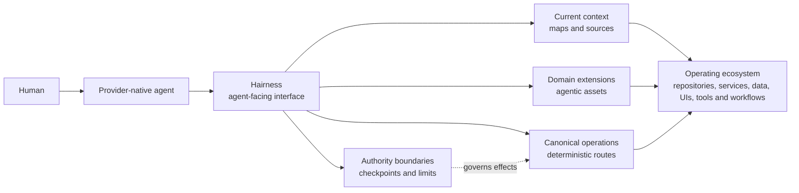

# Hairness

**The provider-agnostic harness for agentic systems you control.**

Hairness equips native AI agents to operate across your ecosystem. It gives
them progressive context, domain-specific operations, deterministic routes and
explicit authority while their model, interface and tools stay native to the
provider.

> [!WARNING]
> **Experimental alpha.** Hairness is ready for evaluation and dogfooding, but
> its protocol, commands and extension contracts may change before 1.0. Pin
> exact versions and keep effects checkpointed.

Implementation **0.2.0-alpha.0** | Protocol **0.2** | Node.js **22+** |
Providers **Codex and Claude** | License **MIT**

## Give your agent an interface to your operating ecosystem

Agents underperform when they receive too little context, a noisy dump of the
entire system, generic tools or unclear authority. Hairness creates an
agent-facing interface between a provider-native session and the environment
where work actually happens.

Your agent does not need your entire system in its prompt. It needs the right
context, operations and authority for the work at hand.



Hairness is the stable home for the operating contracts. Repositories,
services, databases, APIs, user interfaces, knowledge sources and workflows
remain native connected targets. Active extensions decide which of those
targets are visible and which operations exist; visibility never grants
authority.

Context is progressive. The main session starts with a compact opening, then
pulls maps, sources and deeper evidence only when the intent requires them. A
map or artifact orients the agent; current sources remain the proof of truth.

| Know the terrain | Direct the work | Keep authority |
| --- | --- | --- |
| Compact openings, registered codebases, maps, live sources and operational memory orient the agent without flooding the prompt. | Agentic assets, extensions, commands, capabilities and canonical operations translate domain intent into routes the agent can use. | Typed invocations, explicit limits, effect policies, checkpoints, result gates and receipts keep humans in control of consequential work. |

## Work through the agent, not around it

The provider-native main session is Hairness's primary human interface. The
human brings intent, priorities and decisions; the agent gathers the right
context, selects active operations and returns compact typed outcomes.

Hairness is agent-first, not agent-only. Humans can still use a CLI, IDE,
browser or domain UI directly whenever that is more ergonomic. Those tools do
not need to move into Hairness: an extension can expose the right operation
while the underlying system keeps its own runtime and interface.

A general-purpose native agent becomes a domain-adapted operator through the
extensions and contracts selected by a Hairness distribution. Its reach is
always bounded by the active extensions, available sources, provider
capabilities and authority granted for the current operation.

## How one intent moves

Natural language and direct automation converge on the same canonical
Invocation. Semantic choices stay with the main-session model; mechanics that
do not benefit from inference stay deterministic.

```text
Human intent
    |
Provider-native agent
    |
InvocationDraft
    |
deterministic resolution
    |
route: deterministic | inline | worker | external
    |
checkpoint: effects only
    |
ResultGate
    |
typed result + proof + limits
    |
InvocationReceipt
```

`--auto` can remove a soft preview, but it never bypasses trust, ambiguity,
authority, target expansion, result validation or partial-effect handling.
Observe and derive work can use bounded producer routes; effects require an
executor with an exact grant.

## Think in agentic assets, not only delivery surfaces

An **agentic asset** is a versioned unit that changes what an agent can
understand or do. A skill can be the complete asset. For a larger operational
capability, the skill may be only one entry point beside instructions,
commands, schemas, scripts, workers, runtime components, state, tests and
result contracts.

Hairness provides the common design grammar: capabilities, observe/derive/effect
operations, routes, typed results, proof, limits and authority. Extensions own
the opinionated domain behavior. A distribution owns the selected source.

External CLIs, connectors, MCP servers, browser tools and execution loops can
remain independently owned. Hairness composes them through explicit source or
operation boundaries instead of absorbing every useful tool into its runtime.

## Where Hairness fits

- **Existing and legacy ecosystems.** Add an agentic layer around systems
  without scattering provider-specific files through every target repository.
  Start with read-only inspection and codebase maps, then add controlled
  operations only where they create value.
- **Multi-repository work.** Keep one operating home while registered
  codebases remain separately mounted, revisioned and addressable targets.
- **Greenfield agentic systems.** Design domain capabilities, result contracts
  and authority boundaries before prompts and scripts become accidental
  infrastructure.
- **Operational extensions.** Turn team methods, product workflows or personal
  routines into maintained assets that can combine deterministic tooling with
  model judgment and human checkpoints.

## Source-owned and provider-native

Hairness contains no model and does not replace the provider runtime. Codex and
Claude keep their models, conversations, sandboxes, tools and native workers.
Hairness compiles the same active extension contracts into their repo-local
surfaces and validates the shared invocation path behind them.

Generated distributions use an open-code model: selected source is copied into
a standalone repository, with provenance and compatibility recorded in
`hairness.lock.json`. Updates are explicit proposals, and consumer divergence
requires review. There is no mandatory Hairness service or daemon.

Provider independence is an architectural boundary, not a claim of universal
support. Protocol 0.2 currently ships projections for Codex and Claude only.

## Evaluate the alpha

> [!NOTE]
> The npm package is prepared but not published. The future
> `npx @hairness/cli@next create ...` bootstrap is not available yet.

Clone the forge to inspect and test the current alpha:

```bash
git clone https://github.com/thevzion/hairness.git
cd hairness
npm install
node bin/hairness.mjs opening --json
node bin/hairness.mjs build --check
npm run check
npm test
```

Then open a fresh trusted Codex or Claude session in the checkout and use the
repo-local Hairness command surface. Review the [known limitations](docs/known-limitations.md)
before testing effects.

## Documentation

- [Protocol specification](SPEC.md)
- [Architecture](docs/architecture.md)
- [Agentic assets](docs/concepts/agentic-assets.md)
- [Main session](docs/concepts/main-session.md)
- [Invocations](docs/concepts/invocations.md)
- [Extensions](docs/extensions/README.md)
- [Provider projections](docs/adapters.md)
- [Security model](docs/security-model.md)
- [Current status](STATUS.md)
- [Roadmap](ROADMAP.md)

## Development

```bash
npm install
node bin/hairness.mjs build --check
npm run check
npm test
npm run conformance
npm run check:pack
```

Contributions should start with [CONTRIBUTING.md](CONTRIBUTING.md). Security
reports follow [SECURITY.md](SECURITY.md). Hairness is licensed under the
[MIT License](LICENSE).

