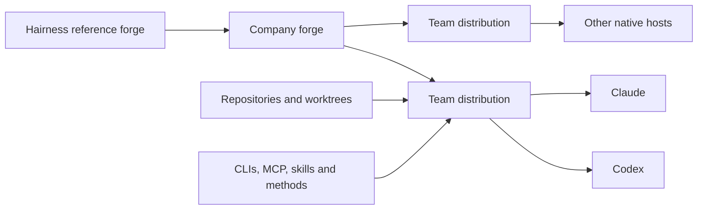

# Hairness

## Make every coding agent fluent in how your company works.

Hairness is a source-owned forge for agent environments and a stable home for the main session. Repositories and worktrees become mounted targets; your operating context, commands, safeguards, and durable work remain coherent even when the code moves.

**Keep the model native. Make the operating context yours.**

Status: **pre-alpha** · Implementation: **0.2.0-alpha.0** · Protocol: **0.2** · Node.js: **22+** · Providers: **Codex, Claude**

The name is a joke. The context discipline isn't.

## Drive the main session

Human-facing provider commands are the primary interface. Active extensions own them; Hairness projects the same intent into each provider's native skills, hooks, workers, and UI.

| Command | Outcome |
| --- | --- |
| `hairness-onboarding` | Configure one local decision at a time |
| `hairness-wake-up` | See only the signals that matter now |
| `hairness-work-discuss` | Reason inside the active frame without effects |
| `hairness-work-recap` | Preserve the meaning of a completed segment |
| `hairness-work-plan` | Produce a typed plan from accepted decisions |
| `hairness-map-codebase` | Map an exact mounted checkout with a bounded worker |
| `hairness-handoff` | Preserve session meaning without a transcript |
| `hairness-update` | Inspect provenance and propose only safe source updates |

Codex invokes commands as `$hairness-…`; Claude uses `/hairness-…`. `hairness-help` shows the exact active surface.

## From reference forge to native providers



A company may use the package directly, maintain a forge that owns its catalogue, or do both. Generated distributions contain their runtime sources and selected extensions; they do not depend on the upstream checkout at runtime.

## Quickstart

The npm alpha is not published yet. Once it is available:

```bash
npx @hairness/hairness@next create ./acme-hairness
cd acme-hairness
npm install
hairness onboarding next
```

The default creates a private, `UNLICENSED` team distribution using the `standard` starter. To create a company forge instead:

```bash
npx @hairness/hairness@next create ./acme-agent-forge --role forge
```

The wizard confirms language first, presents one checkpoint, initializes Git, and asks explicitly before creating a root commit. It never creates a remote, pushes, tags, or publishes.

## Repositories are targets. Hairness is the agent's home.

One codebase identity may have several named checkouts:

```bash
hairness codebase mount app ~/code/app --as default
hairness codebase mount app ~/code/app-fix-123 --as fix-123
hairness codebase app doctor --checkout fix-123
```

Every operation freezes the codebase, checkout, realpath, branch, HEAD, dirty baseline, and digest into a target set. Mounting creates addressability, never authority. Hairness does not clone, create worktrees, or capture repository workflows.

## Source-owned lifecycle

`create` transfers ownership. A generated `hairness.lock.json` records the recipe, source, selected materials, versions, policies, and base digests.

```bash
hairness distribution inspect
hairness update check
hairness update plan --scope extension:hairness/cockpit
hairness update apply <plan-id> --checkpoint <id>
```

An update is safe only when the consumer material still matches its recorded base. Consumer divergence, dependency changes, owner conflicts, or edited managed regions require review. Hairness performs no automatic merge and no Git automation.

**Create transfers ownership. Update proposes change.**

## Capabilities are versioned, tested, and composable

The core owns contracts and lifecycle guarantees. Extensions own behavior, commands, sources, policies, artifacts, and tests. The distribution owns selection.

The `standard` team distribution selects cockpit, lifecycle, Workframes, presentation, constraints, session intelligence, codebases, source controls, and Git. Forge-only maintenance and replayable qualification stay out of team payloads unless selected explicitly.

External methodologies can be bound declaratively to existing semantic contracts. Raw provider output remains in the run or scratch; only validated meaning crosses an artifact boundary.

**Persist meaning at semantic boundaries, not every model output.**

## Hairness complements the agent ecosystem

| Category | Examples | What remains native | What Hairness adds |
| --- | --- | --- | --- |
| AI hosts | Codex, Claude | Models, UI, sandbox, workers | One source-owned operating contract projected per host |
| Methodologies | Superpowers, team skills | Reasoning procedure and native invocation | Declarative bindings, context selection, semantic result contracts |
| Execution loops | Autonomous coding loops | Iteration runtime and stopping strategy | Bounded routing, authority, targets, receipts, fan-in |
| Sources and tools | Git, Jira, CLIs, MCP servers | Actual reads and effects | Typed operations, proof, requirements, explicit limits |
| Plugins | Provider-native extensions | Host-specific packaging and UX | A portable owner model and deterministic projections |

Hairness does not replace these tools. It federates them without hiding their strengths or moving the model into a weaker proprietary runtime.

**Standardize the environment, not the intelligence.**

## The prologue is a typed API

At session start, trusted extensions contribute compact typed fragments. Hairness aggregates them into a sub-4 KiB opening containing effective language, profile, active work, mounted targets, readiness, freshness, limits, and at most three attention signals. Workers receive only their bounded capsule, never the main-session cockpit.

No network lookup runs during session opening or wake-up. External sources are consulted only through explicit commands.

## Lightweight by construction

- One Node.js CLI, no daemon and no proprietary agent runtime.
- Repo-local Codex and Claude projections, no plugin or marketplace dependency.
- Native provider workers rather than a parallel multi-agent UI.
- JSON as canonical state; compact human views are projections.
- Deterministic gates where inference adds no value.

**Provider-native execution. Company-owned context. Explicit boundaries.**

## Engineering first, broader by design

Hairness starts with engineering because repositories, tickets, tests, and Git provide strong proof surfaces. The same source-owned distribution model can industrialize provider-native agent capabilities for operations, support, sales, or any team that needs shared context and explicit boundaries.

## Safety

- Non-invasive integration. Explicit operation.
- No authority from a command, extension, mount, artifact, binding, or prior grant.
- No effect outside the checkpoint, worker capsule, exact target set, current policy, and valid lock.
- No transcript, model reasoning, secret, credential, or production data in Hairness state.
- No fan-out without fan-in.

## Documentation

- [Protocol specification](SPEC.md)
- [Architecture](docs/architecture.md)
- [Distribution lifecycle](docs/concepts/distribution-lifecycle.md)
- [Session home](docs/concepts/session-home.md)
- [Extensions](docs/extensions/README.md)
- [Provider projections](docs/adapters.md)
- [Security model](docs/security-model.md)
- [Current status](STATUS.md)
- [Contributing](CONTRIBUTING.md)

## Development

```bash
npm install
hairness session opening --json
hairness build --check
npm run check
npm test
npm run conformance
npm run check:pack
```

Hairness is licensed under the [MIT License](LICENSE).

**Your tools do the work. Hairness makes them work together.**
