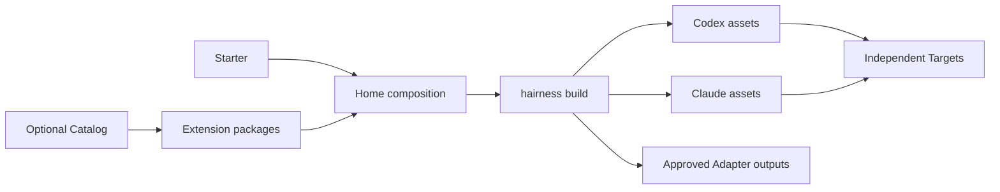

# Hairness

Hairness is a small, provider-neutral kernel for composable agent Homes.

A Home pins its agentic assets as npm dependencies, selects them in
`hairness.json`, and builds native Codex and Claude projections. Product
repositories stay independent Targets.

> Hairness 0.4 is an alpha. Pin exact versions and review every Adapter before
> approving its build.

Node.js 22 or 24 · Codex and Claude · MIT

## Create a personal Home

```bash
npx --yes @hairness/cli@0.4.0-alpha.0 create "$HOME/Hairness"
cd "$HOME/Hairness"
npm run doctor
```

Creation installs the exact CLI, Starter and required Extensions with npm
lifecycle scripts disabled. It builds both providers, initializes Git, creates
one initial commit, configures no remote, and moves the finished Home into place
atomically.

The default `@hairness/starter` activates `@hairness/native`, which provides
orientation, onboarding and explicit Scratch memory.

```text
Hairness/
├── package.json
├── package-lock.json
├── hairness.json
├── AGENTS.md
├── CLAUDE.md
├── targets/
└── .overlay/config.json
```

`package-lock.json` is the only dependency lock. `.hairness/build.json` is local,
ignored build state. There is no `hairness.lock.json`.

## Add an Extension

An Extension is an npm package with a `package.json#hairness` manifest:

```json
{
  "name": "@acme/review",
  "version": "1.2.3",
  "type": "module",
  "files": ["assets/"],
  "hairness": {
    "apiVersion": "hairness.dev/package/v1alpha1",
    "kind": "Extension",
    "summary": "Review one change.",
    "subtype": "assets",
    "contributes": {
      "skills": [{
        "id": "review",
        "summary": "Review one change.",
        "path": "assets/review.md"
      }],
      "commands": [{
        "id": "review",
        "skill": "review"
      }]
    }
  }
}
```

Install directly from an exact npm version, Git tag or commit:

```bash
hairness extension add @acme/review@1.2.3
hairness extension add 'git+https://github.com/acme/review.git#v1.2.3'
hairness extension update @acme/review --to @acme/review@1.2.4
hairness extension remove @acme/review
```

Local `file:` packages are supported for development and must be stored in the
Home, usually under `vendor/`. Ranges, branches, `HEAD`, dist-tags and
unversioned registry packages are rejected.

## Use a Catalog

A Catalog is a thin optional index. Direct installation remains available.

```bash
hairness catalog add acme @acme/hairness-catalog@1.0.0
hairness catalog search review
hairness extension add catalog:acme/review
```

The Catalog is an npm or exact Git package whose manifest points to a JSON index
of entry IDs and exact package specs. A web marketplace is not required.

## Compose a team Home with GSD

The official `@hairness/adapter-gsd` package is kept in a separate repository and
pins `@opengsd/gsd-core@1.6.1`. During this prerelease it is qualified from an
exact local tarball:

```bash
hairness extension add file:vendor/hairness-adapter-gsd-0.4.0-alpha.0.tgz \
  --allow-build
```

The Adapter calls GSD's official installer in staging. Hairness accepts only its
declared `.codex` output, rejects symbolic links and owner collisions, records
every digest, and keeps npm lifecycle scripts disabled.

A private downstream Starter combines Native, the GSD Adapter, team skills,
Target declarations and Integration choices. Its packed journey is tested
without publishing private repositories, URLs, credentials or business data.
The complete ticket loop remains downstream.

## Ownership model



- The Home owns package selection, provider projections and explicit human
  memory.
- Extensions own their source assets and declared build outputs.
- npm owns dependency resolution and locking.
- Targets own product source and Git history.
- Integrations describe accessors only; Hairness installs no tool and stores no
  credential.

## CLI

```text
hairness create <home> [--starter <exact-spec>]
hairness build [--check]
hairness doctor [--json]
hairness prologue [--json]
hairness extension list|add|update|remove|doctor
hairness catalog list|search|add|update|remove
hairness target list|discover|add|bind|unbind|remove|doctor
hairness integration list|add|bind|unbind|remove|doctor
```

`build --check` performs no write. `doctor` reports package, build, Target and
Integration limits. Generated files are path-owned: divergence and unmanaged
collisions stop the build.

## Development

```bash
npm ci --ignore-scripts
npm test
npm run check
npm run conformance
npm run check:providers
npm run check:pack
npm run check:lab
npm run test:node22
npm run test:node24
```

Read the [specification](SPEC.md), [architecture](docs/architecture.md),
[security model](docs/security-model.md), and [release process](docs/releasing.md).
