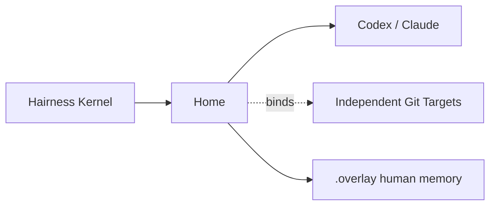

# Hairness

**A small, provider-neutral home for agentic work.**

Hairness gives an agent one stable place for instructions, explicit memory and
portable extensions. Your repositories stay independent Targets; Codex and
Claude receive the same neutral assets in their native formats.

Node.js 22+ · npm · Codex and Claude · MIT

## Install and create a Home

```bash
npx --yes @hairness/cli@next create ~/agentic-tools-home
```

The Home is a normal Git repository. The CLI installs a pinned runtime, builds
provider assets, initializes an empty local commit and prints launch commands.
It never creates a remote or pushes.

```bash
codex -C "$HOME/agentic-tools-home" --add-dir "/path/to/repository"
cd "$HOME/agentic-tools-home" && claude --add-dir "/path/to/repository"
```

Then invoke `$hairness-onboarding` in Codex or `/hairness-onboarding` in Claude.
The agent speaks the selected language, helps bind independent repositories,
selects declared integrations and explains the next useful route.

## The model



- **Home** owns provider-neutral agentic assets and tracked configuration.
- **Target** is an independent Git repository, optionally bound as
  `targets/<id>` (an ignored symlink to a clone or worktree).
- **Integration** names an external accessor such as `cli:jira` or a provider
  tool. Hairness never installs or authenticates it.
- **Scratch** is one plain `.overlay/scratches/<slug>/scratch.md`, created only
  when explicitly requested.
- **Prologue** is a compact runtime orientation with `preferences`, `facts` and
  `signals`; it is not a health dashboard.

## Deterministic surface

```text
hairness create <home>
hairness build [--check]
hairness doctor [--json]
hairness prologue [--json]
hairness extension list|add|update|remove|doctor
hairness target list|discover|add|bind|unbind|remove|doctor
hairness integration list|add|bind|unbind|remove|doctor
```

The only built-in agent commands are `hairness`, `hairness-onboarding` and
`hairness-scratch`. Hairness does not pretend to be a thinking methodology:
projects such as Think It Through remain ordinary Targets and extensions can
provide their own neutral skills.

## Agentic assets are software

An extension is explicit and provider-neutral. A minimal chat extension is two
files:

```text
acme/review/
├── extension.json
└── skills/review/skill.md
```

```json
{
  "apiVersion": "hairness.dev/extension/v1alpha2",
  "kind": "Extension",
  "metadata": { "id": "acme/review", "version": "1.0.0", "summary": "Review a change." },
  "spec": {
    "skills": [{ "id": "acme-review", "summary": "Review a change.", "path": "skills/review/skill.md" }],
    "commands": [{ "id": "review", "skill": "acme-review", "summary": "Review now." }]
  }
}
```

```bash
hairness extension add ./acme/review
hairness extension add https://github.com/acme/review.git --ref v1.2.0
```

The source uses `skill.md`; Hairness generates `SKILL.md` projections for each
provider. Inspection validates paths and manifests without executing extension
code. Physical presence never activates an extension.

## What is tracked

```text
Home/
├── hairness.json             # providers, extensions, Target identities, config
├── hairness.lock.json        # pinned Kernel and extension provenance
├── package.json / lockfile   # pinned runtime
├── extensions/               # explicitly active sources
├── .overlay/                 # human preferences, Scratches, accepted documents
├── targets/                  # ignored local symlinks
├── AGENTS.md / CLAUDE.md     # small managed regions, user text preserved
└── .hairness/                # ignored build and temporary state
```

Generated provider files are exact local build outputs and are excluded through
`.git/info/exclude`; native files Hairness does not own remain visible to Git.
No transcript, hidden reasoning, secret, absolute Target path or runtime lock is
stored in the tracked Overlay.

## Development

```bash
npm install
npm test
npm run check
npm run conformance
npm run check:providers
npm run check:pack
npm run check:lab
```

See [SPEC.md](SPEC.md), [architecture](docs/architecture.md),
[persistence](docs/persistence.md), [extensions](docs/extensions/README.md) and
[security](docs/security-model.md). Hairness 0.4 is a breaking reset: create a
new Home instead of migrating a v0.3 Home.
