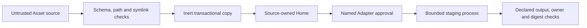

# Security policy

Hairness `0.4.0-alpha.1` is prerelease software. Report vulnerabilities through
[GitHub Security Advisories](https://github.com/thevzion/hairness/security/advisories/new).
Do not put credentials, private Home content or unpublished company assets in a
public issue.

## Trust model

Hairness treats every manifest and static file as untrusted input. It treats an
approved Adapter as executable source with local access. Review the Adapter
before passing `--allow-adapter`.

Provider sessions and their tools remain outside Hairness authority. A composed
Home does not authorize an agent to change a Target or use an Integration.

## Enforced controls

- JSON schemas reject unknown fields and invalid manifests.
- Source and destination checks reject escaping paths, duplicate destinations
  and symbolic links.
- HTTPS sources reject credentials and query strings in URLs. Redirects must
  remain on HTTPS.
- `add`, `status`, `diff`, `sync` and `remove` execute no Asset code.
- Transactions stage all writes, back up touched paths and restore them after a
  failed promotion.
- Sync and remove stop on local divergence unless the user passes
  `--overwrite`. Undeclared local files survive both operations.
- `build --check` and `sync --check` write nothing.
- Adapter execution requires a named approval. Hairness limits runtime and
  output size, clears most environment variables and rejects undeclared,
  reserved, symbolic-link or colliding output.
- Target binding verifies a Git remote before creating a local symlink.
- Integration bindings select accessors and contain no credentials.
- Prologue rejects secret-like material before rendering it into a session.

## User responsibilities

Commit a Home before changing Assets. Pin Git sources with a tag or full
commit when reproducibility matters. Review source diffs and Adapter code.
Protect the Home repository according to the sensitivity of its agentic assets.

The Adapter process does not provide an operating-system sandbox. Run Hairness
inside an isolated environment when you do not trust the Adapter author.
