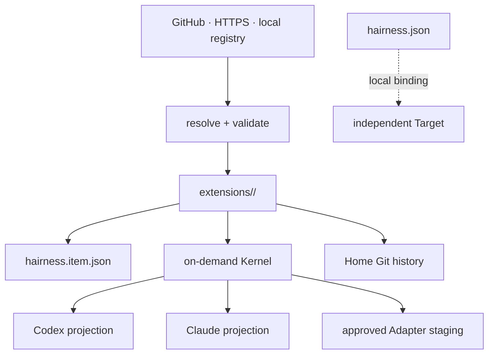

# Architecture

Hairness has five explicit owners:

| Owner | Owns |
| --- | --- |
| Registry | discoverable item manifests and source files |
| Home | copied assets, composition, explicit memory and Git history |
| Kernel | validation, synchronization and provider projections |
| Provider | agent runtime, sessions and tools |
| Target | product source and its independent Git history |

## Source lifecycle

Resolvers materialize an item fully in memory, validate its graph and paths, and
only then enter a filesystem transaction. Each receipt is local provenance, not
a global lock. Status reads only the receipt and current files. Sync resolves a
fresh source, compares both versions, then either applies one transaction or
writes nothing.

## Build lifecycle

The Kernel reads receipts rather than a package graph. Skills and instructions
are projected to each active provider. `.hairness/build.json` records generated
path, provider, owner and digest. Reconciliation refuses ownership ambiguity and
preserves unmanaged files.

Adapter source is installed like any other file. Explicit build approval is the
only transition that can execute it. Output remains in a temporary staging root
until every declared-path and symlink check succeeds.

## Why no package manager

Hairness does not solve versions, retain a global store, run install hooks or
update in the background. A tag or commit can pin distribution; Git records the
Home’s actual state. This keeps the abstraction at the agentic-asset layer.
