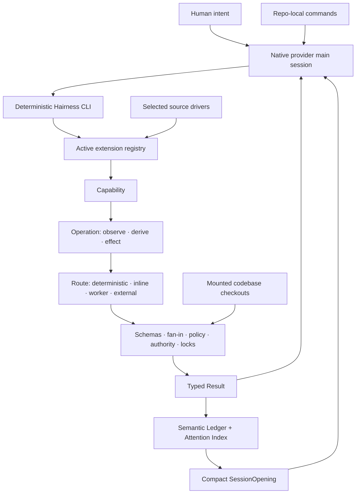
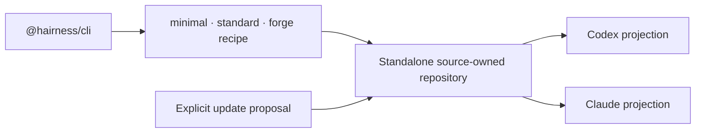

# Architecture

Hairness separates a minimal protocol kernel from selected behavior and native provider execution.



## Owners

| Owner | Owns | Does not own |
| --- | --- | --- |
| Kernel | contracts, registry, storage, runs, plans, fan-in, artifacts, authority enforcement, locks | domain behavior or concrete sources |
| Extension | capabilities, operations, commands, services, contributions, schemas, instructions, tests | implicit authority |
| Distribution | active selection, defaults, source drivers, codebase contracts, provider projections | upstream control after generation |
| Provider adapter | Codex/Claude syntax and managed output mechanics | capabilities or model runtime |
| Provider | model, UI, tools, sandbox, native workers and threads | Hairness source ownership |
| Mounted codebase | Git history, runtime, conventions and files | Hairness local state |

The generic invocation store and event lifecycle live in the kernel. Operation lookup, preferences and trusted resolver contributions live in the distribution layer. Provider models may propose drafts but never mutate canonical invocation state directly.

Forge-only Initiative and Delivery Controls sit above Work Controls. They
preserve macro outcomes, parallel change plans and aggregated release evidence
while delegating every GitHub Flow or publication effect to a separately
checkpointed native executor. GitHub and npm remain source drivers and URI
targets; the kernel knows only plans, effects, policies, checkpoints, locks and
receipts.

```text
core owns grammar
extensions own behavior
distribution owns selection
providers own execution
```

## Source-owned flow



A recipe selects named material sets. Hairness resolves their declared dependency graph, rejects cycles and target conflicts, and copies the exact resulting entries. A generated distribution contains selected extensions and drivers only. A forge can retain dormant generic catalogue source, but only manifest-selected extensions execute.

## State

```text
Git tracked
├── kernel and public schemas
├── selected extension source
├── selected source drivers
├── hairness.json and hairness.lock.json
├── provider projections and hairness.build.json
└── distribution-owned documentation

.overlay (workspace local)
├── config and named codebase mounts
├── invocation ledger and epoch
├── runs, artifacts and scratch
├── extension-owned state
└── local-only extension projections

~/.hairness (user local)
├── preferences
├── workspace and local-extension trust
└── canonical path and credential-free URI locks
```

Tracked `.hairness/` state belongs to the distribution. Ignored `.overlay/` state belongs to the local workspace. Personal preferences and trust live in `~/.hairness/`. None of these locations activates an extension by presence.

No provider transcript or hidden reasoning crosses these boundaries.
