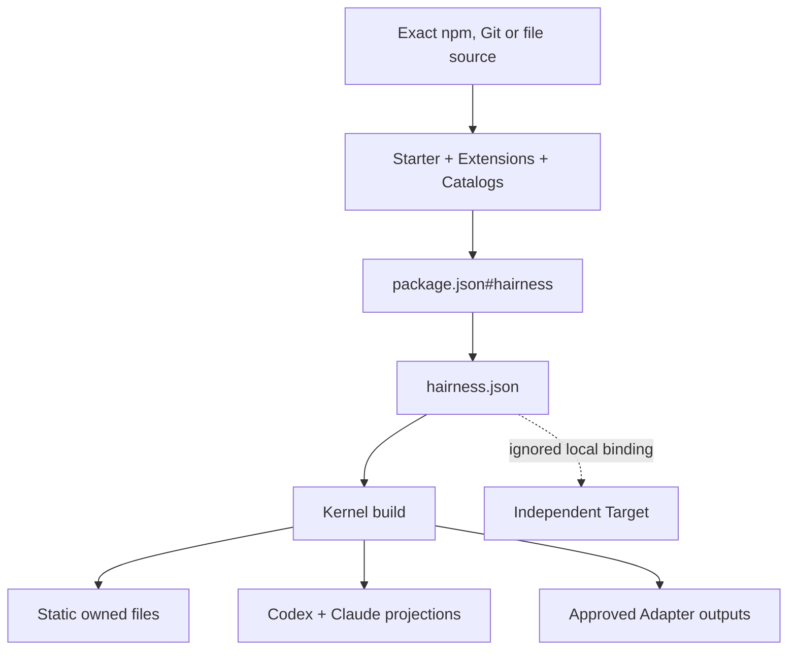

# Architecture

Hairness has four owners:

| Owner | Owns |
| --- | --- |
| npm | dependency resolution and `package-lock.json` |
| Package | Starter, Extension or Catalog source |
| Home | active composition, projections and explicit memory |
| Target | product source and Git history |

## Kernel

`@hairness/cli` validates documents, calls npm with lifecycle scripts disabled,
builds desired output, manages Targets and Integration bindings, and renders the
prologue. It contains no team workflow.

## Native and Starter

`@hairness/native` is an ordinary Extension containing the fundamental Hairness
instructions and Skills. `@hairness/starter` is the default personal bootstrap.
Neither has privileged access to the Kernel.

## Build state

`.hairness/build.json` records each generated path, provider, owner and digest.
It is ignored and reproducible. Build compares desired content with the previous
owner state and the current filesystem before writing. Unmanaged files remain
untouched.

## Adapters

An Adapter receives typed Home context on stdin and writes only to
`HAIRNESS_OUTPUT_DIR`. `HAIRNESS_HOME_DIR` names the final Home so atomic
creation remains deterministic; `HAIRNESS_STAGE_DIR` exposes the physical
staging checkout when an official installer needs a working directory.

The process boundary limits accidental writes accepted by Hairness. It is not an
OS sandbox for hostile code.
