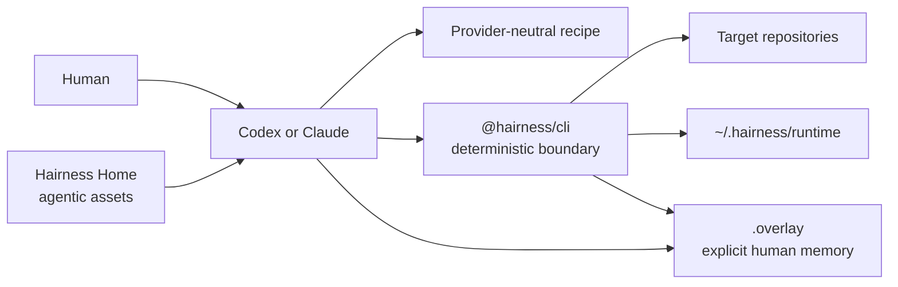
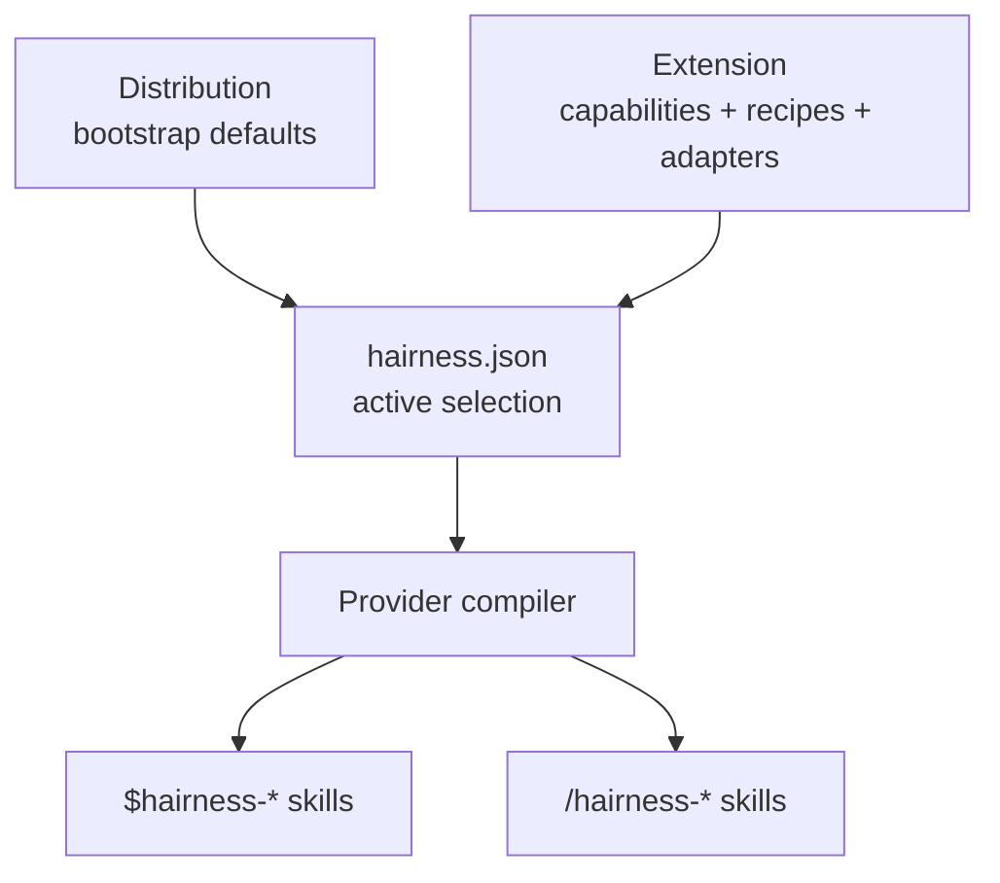

# Architecture

Hairness adds a small deterministic harness around native AI-agent sessions. It
separates source-owned agentic assets from local runtime bindings and from the
repositories an agent works on.

## Four ownership layers

| Layer | Owns | Never owns |
| --- | --- | --- |
| npm runtime | CLI, schemas, registry, compiler, checkpoints, receipts and local Source bindings | provider sessions or team policy |
| Home | selected extensions, provider-neutral recipes, tracked configuration and lock provenance | target checkout state or generated projections |
| Overlay | explicit profile, Scratch, accepted Artifacts and Receipts | transcripts, secrets or runtime locks |
| Target | product source, Git history and project conventions | Hairness configuration or memory |

The Home may be a sibling of one Target or coordinate many independent Targets.
Generated Codex and Claude projections are reproducible build output. Exact owned
paths live in runtime `build.json` and are locally excluded from the Home Git
repository; unmanaged native provider files remain untouched.

Target identity is core (`hairness.targets`), not an extension. A Home declares
expected remotes and binds a local checkout through an ignored `targets/<id>`
symlink. `hairness/work` owns live mapping. `hairness/sources` owns declarations
and local access bindings for external CLIs or provider tools.

## Composition

A Distribution is a bootstrap bundle, not a runtime role. An Extension provides
capability IDs. Recipes converse directly with the user. Adapters expose a
deterministic `observe`, `derive` or `effect` operation. Only effect adapters pass
through `prepare` and `apply` with an exact Checkpoint.

## Work and delivery

Scratch is the work identity. A delivery extension may choose a compatible clean
checkout or create an isolated Git worktree internally. Checkout paths and locks
remain runtime details. A typed DeliveryBrief is saved only after its delivery
hypothesis is accepted. Publication, merge and release are separate effects.

See [Persistence](persistence.md), [Extension contract](extensions/README.md) and
[ADR 0013](decisions/0013-v0-3-clean-architectural-reset.md).
