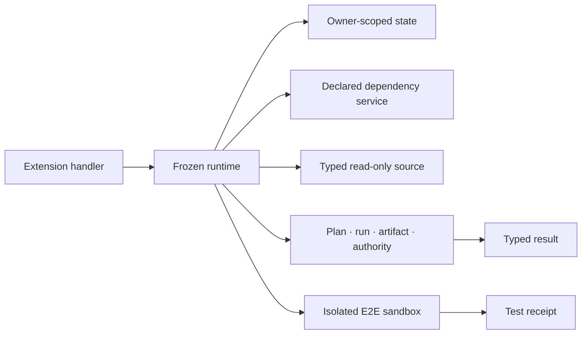

# Architecture

Hairness separates the team-owned cockpit from provider execution and business codebases.

```mermaid
flowchart TD
    reference["Reference forge"] --> forge["Company forge · owned catalogue"]
    forge --> recipe["Distribution recipe"]
    recipe --> dist["Standalone distribution · selected source only"]
    dist --> registry["Active extension registry"]
    registry --> commands["Canonical commands and modifiers"]
    commands --> compiler["Repo projection compiler"]
    compiler --> codex["AGENTS.md · .agents · .codex"]
    compiler --> claude["CLAUDE.md · .claude"]
    human["Human intent"] --> main["Provider main session"]
    codex --> main
    claude --> main
    main --> cli["Deterministic Hairness CLI"]
    cli --> runtime["Frozen owner-scoped runtime"]
    runtime --> routes["Deterministic routes · producer · executor"]
    routes --> gates["Schemas · constraints · authority · fan-in"]
    gates --> graph["Runs · artifacts · Workframes graph"]
    graph --> main
    targets["Named repository checkouts"] --> runtime
```

## Ownership

- The core owns contracts, storage, lifecycle, exact effect enforcement, locks, fan-in, and bounded contribution aggregation.
- Provider adapters own host syntax. `hairness/maintainer` owns replayable test sandboxes; omitting that extension removes the feature entirely.
- The distribution owns identity, active extensions, sources, codebases, and defaults.
- `hairness/distribution` owns provenance inspection and update behavior; the generic distribution engine performs only bounded material comparison and application.
- Extensions own commands, capability logic, services, source operations, artifact schemas, relations, guidance, and tests.
- Providers own model execution, threads, worker UI, and native tool access.
- Codebases retain their Git history, tools, conventions, and runtime.

The rule is simple: **the core owns the grammar; extensions own the capabilities.** Physical presence in a forge catalogue never activates code.

## State boundaries

```text
Git-tracked
├── core and schemas
├── selected extensions
├── hairness.lock.json provenance and material bases
├── AGENTS.md and CLAUDE.md managed regions
├── .agents/skills
├── .codex config, hooks, and workers
├── .claude skills, settings, and workers
└── hairness.build.json

Workspace-local .overlay
├── config and named mounts
├── runs and artifacts
├── extension state and Workframes events
├── local-only provider projections
└── extension-owned local state

User-local ~/.hairness
├── preferences
├── workspace and local-extension trust
└── global realpath locks
```

The distribution manifest owns shared repository contracts. Local configuration may add private hub contracts and materialize mounts under `.overlay/codebases/<codebase>/<checkout>`. Linked extensions under `.overlay/extensions/` retain their external source owner and contribute only to ignored local projections.

Provider transcripts remain provider application data. Hairness may consume an explicitly allowlisted inbox after opt-in, promotes only a semantic digest, then deletes the inbox.

## Runtime boundary



The runtime exposes no general codebase or external-system mutation primitive. Local mount and link operations mutate only Hairness integration state after a checkpoint. An executor reaches a target only through an operation-scoped grant and capsule.
