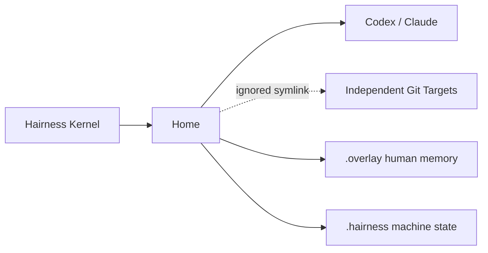

# Architecture

The Kernel validates four document types, composes neutral agentic assets,
binds Git Targets and Integrations, renders a bounded prologue and projects
provider-native files. The Home is the durable boundary. Targets and provider
sessions remain outside it.

The source layout follows the same responsibilities: `home`, `targets`,
`integrations`, `extensions`, `prologue`, `create`, `doctor` and the provider
compiler. There is no generic workflow, delivery, artifact graph or provider
runtime hidden behind the CLI.

Provider build owns only generated files recorded in `.hairness/build.json`.
Managed regions in `AGENTS.md` and `CLAUDE.md` are replaced narrowly; surrounding
human content and unmanaged skills/hooks survive rebuilds.
