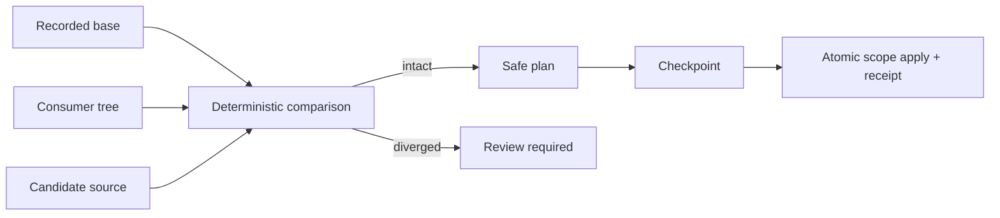

# Distribution lifecycle

`create` copies an operational payload and transfers ownership to its consumer. `hairness.lock.json` records where each Hairness-owned material came from and the digest of the accepted base.

`update plan` compares base, consumer, and candidate. Intact materials may be added, replaced, or removed. Any consumer divergence makes the complete requested scope `review-required`; Hairness does not guess a merge. `update apply` requires the exact checkpoint and produces a receipt without touching Git.

Versioned `MigrationDescriptor` records declare source/target implementation
and protocol versions, scopes, a structured transform and validations.
`migrate plan` copies only affected state into scratch, applies the declared
transform, rebuilds generated projections, and presents changes and limits.
`migrate apply` requires the exact checkpoint and records migration IDs and
digests in `hairness.lock.json`.

```bash
hairness migrate status
hairness migrate plan --to current
hairness migrate apply <plan-id> --checkpoint <id>
```

`update plan` composes the matching migration plan automatically. Intact
Hairness-owned materials remain replaceable. Diverged consumer material and
linked/local extensions are always `review-required`; migrations never perform
an arbitrary consumer merge or codemod.


