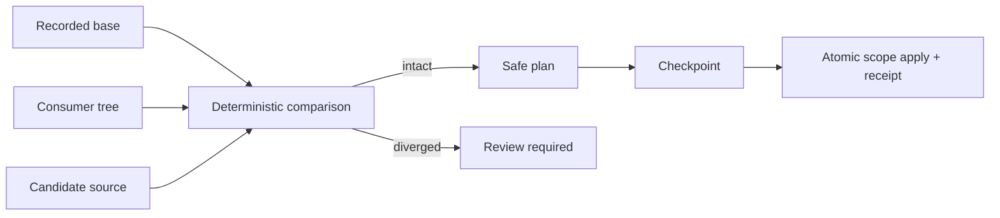

# Distribution lifecycle

`create` copies an operational payload and transfers ownership to its consumer. `hairness.lock.json` records where each Hairness-owned material came from and the digest of the accepted base.

`update plan` compares base, consumer, and candidate. Intact materials may be added, replaced, or removed. Any consumer divergence makes the complete requested scope `review-required`; Hairness does not guess a merge. `update apply` requires the exact checkpoint and produces a receipt without touching Git.

