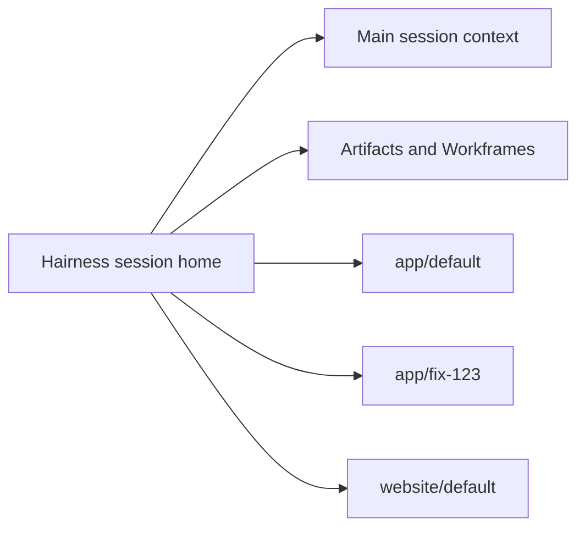

# Session home

Hairness can be the stable working directory for a main agent session. Codebases are registered identities; local clones and worktrees are named checkouts mounted below `.overlay/codebases/<codebase>/<checkout>`.

This separation keeps company context, Workframes, preferences, provider projections, and semantic artifacts stable while repositories change. A mount grants addressability only. Each operation resolves an exact TargetSet before authority can be granted.

