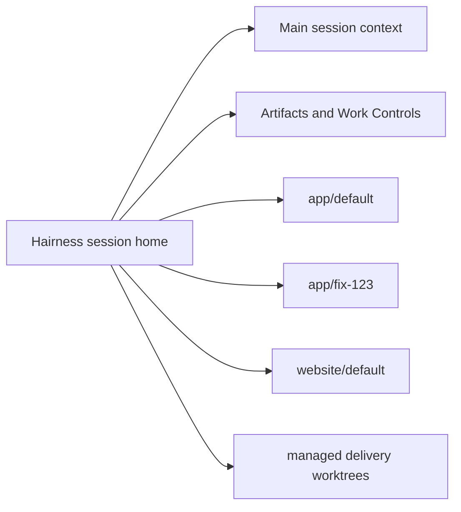

# Session home

Hairness can be the stable working directory for a main agent session. Codebases are registered identities; local clones and worktrees are named checkouts mounted below `.overlay/codebases/<codebase>/<checkout>`.

Delivery work does not mutate this anchor. Worktree Controls resolves one
managed sibling checkout and one writer lease for each plan, while the main
session remains in the stable home and receives only the handle, proof and
compact worker result.

This separation keeps company context, Work Controls, preferences, provider projections, and semantic artifacts stable while repositories change. A mount grants addressability only. Each operation resolves an exact TargetSet before authority can be granted.

