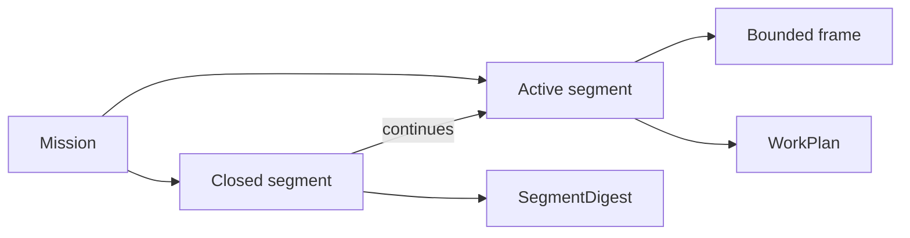

# Work Controls

Work Controls preserve collaboration trajectory without preserving conversation.



- A mission keeps long-lived direction.
- A segment represents one coherent unit of work; only one is active.
- A frame narrows posture and boundary inside the active segment.
- Append-only events preserve state transitions; `current.json` is reconstructible.
- Closing requires a valid SegmentDigest and makes the segment immutable.
- Resuming a closed subject creates a related segment rather than rewriting history.

Frames are not artifacts. They reference sources, runs, decisions, and artifacts. Recap and plan create typed semantic boundaries. Act and execute still require effective constraints and explicit authority.

```text
Work Controls preserve trajectory.
Artifacts preserve meaning.
Sources prove current truth.
```
