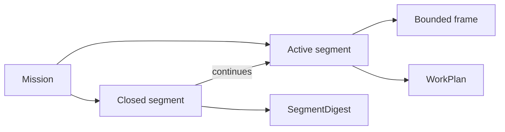

# Work Controls

Work Controls preserve collaboration trajectory without preserving conversation.



- A mission keeps long-lived direction.
- A segment represents one coherent unit of work; only one is active.
- A frame narrows posture and boundary inside the active segment.
- Append-only events preserve state transitions; `current.json` is reconstructible.
- Closing requires a valid SegmentDigest and makes the segment immutable.
- Resuming a closed subject creates a related segment rather than rewriting history.

Frames are not artifacts. They reference sources, runs, decisions, and artifacts. Recap and plan create typed semantic boundaries. Act and execute still require effective constraints and explicit authority.

Provider-facing work controls are chat-first:

- `hairness-x-make-recap` and `hairness-x-make-plan` return response dashboards.
- `hairness-x-save-recap` and `hairness-x-save-plan` request durable artifacts.
- `--auto` advances invocation progress but never changes persistence.

`WorkPlan` is the durable Plan Segment. It carries execution boundary, original frame, frames considered, coherence, already-done evidence, goal, scope and non-goals, target shape, ownership changes, compatibility, decision batch, steps, validation, risks, checkpoints and open questions.

The old `reshape-system` flavor is represented as target-shape controls:
scope, old owner, target owner, legacy kept/deleted, compatibility, proof and
checkpoint. `hairness-x-plan-system-shape` produces that shape in chat;
`hairness-x-save-plan` persists it after acceptance.

```text
Work Controls preserve trajectory.
Artifacts preserve meaning.
Sources prove current truth.
```
