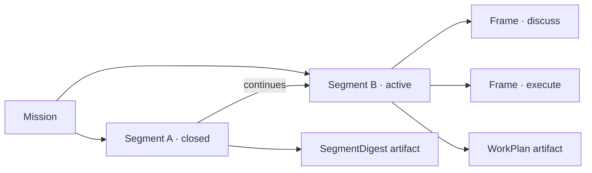

# Workframes

Workframes is the temporal spine of the main session.



- A mission preserves long-lived direction.
- A segment preserves one coherent context window.
- A frame applies one posture and boundary inside the active segment.
- An append-only event log preserves changes; `current.json` is reconstructible.
- A closed segment is immutable and requires a valid `segment-digest`.
- A resumed subject opens a new segment related by `continues`.

Frames are not artifacts. They reference sources, runs, and artifacts. Semantic boundaries create durable artifacts such as SegmentDigest, WorkPlan, decision records, specs, receipts, and handoffs.

```text
Workframes preserves the trajectory.
Artifacts preserve the meaning.
Sources prove current truth.
```
