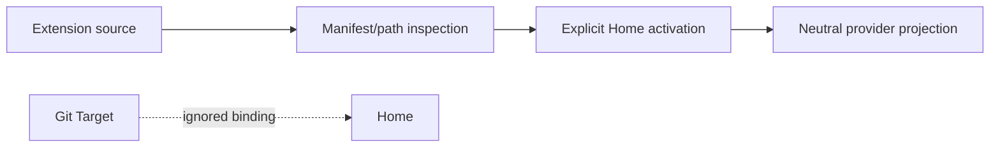

# Security model

The trust boundary is deliberately small:

Inspection executes no extension code, rejects escaping paths and symlinks, and
never activates a physically present extension. Git refs are locked to commits.
Target registration and Integration selection do not grant operational authority.
Hairness does not install tools, authenticate accounts, create remotes or push.

Prologue contributors are timed, isolated, read-only processes returning only
bounded facts and signals. Secrets and obvious credential-like values are
rejected. Provider output ownership is exact; Hairness never clears a whole
provider directory.
