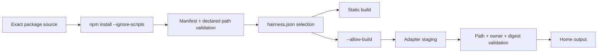

# Security model

## Guarantees

- Unknown manifest fields and escaping paths fail.
- Package files, Starter templates and Adapter output symbolic links fail.
- npm lifecycle scripts never run through Hairness.
- Adapters without recorded build approval fail.
- Undeclared Adapter files and ownership collisions fail before reconciliation.
- Edited owned output fails rather than being overwritten.
- `build --check` writes nothing.
- Targets bind only after Git remote verification.
- Integration bindings contain no credentials.

## Limits

An approved Adapter is executable package code. Node process permissions reduce
the prologue contributor surface, but Adapter execution is not a hostile-code
sandbox. Review the package and lockfile before approval.

Provider sessions may use tools outside Hairness. Hairness composition does not
grant authority to use them.
