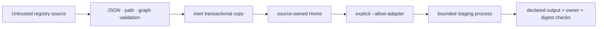

# Security model

## Enforced

- Registry documents reject unknown fields, escaping paths and duplicate
  destinations.
- Local source and installed trees reject symbolic links.
- HTTPS registry credentials are expanded only in request headers and never
  persisted.
- Dependency cycles and collisions fail before Home writes.
- `add`, `view`, `status`, `diff`, `sync` and `remove` execute no installed code.
- Source updates and removals stop on local divergence unless overwrite is
  explicit.
- Undeclared local files survive sync and remove.
- `build --check` and `sync --check` write nothing.
- Adapter execution requires a named approval; undeclared or symbolic-link
  output fails before promotion.
- Targets bind only after Git remote verification.
- Integration bindings contain no credentials.

## Trust boundaries

Registry JSON and static files are untrusted input. An approved Adapter is
trusted executable source. Its child process is bounded by environment, timeout,
output size and accepted paths. Treat it as trusted executable source with local
access and review it before approval.

Provider sessions and their tools remain outside Hairness authority. A composed
Home does not authorize actions against Targets or Integrations.
